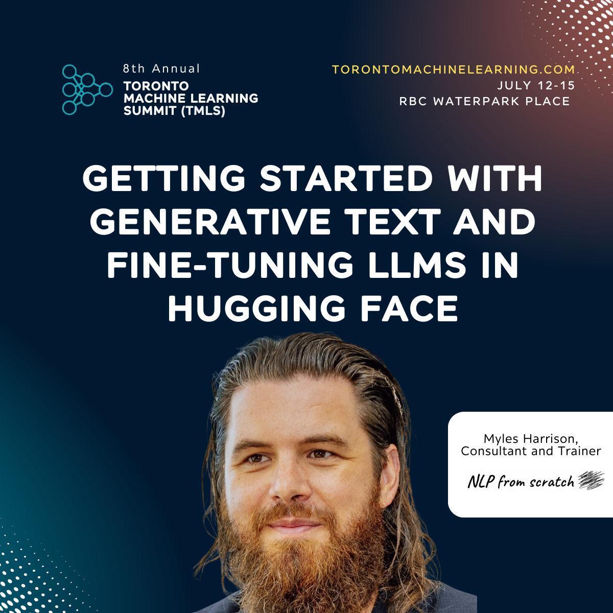

# Getting started with Generative Text and Fine-tuning LLMs in Hugging Face



This is the git repo for the files for the [NLP from scratch](https://www.nlpfromscratch.com) "Getting started with Generative Text and Fine-tuning LLMs in Hugging Face" workshop presented at the 8th Annual [Toronto Machine Learning Summit (TMLS)](https://www.torontomachinelearning.com/), on Thursday, July 11th, 2024.

## Description

**Talk Abstract:**  
If you're new to working with LLMs hands-on in code, this is the session for you! In this introductory workshop, you'll get working with Hugging Face and the transformers library for generating text from LLMs and applying performance efficient fine-tuning methods to a generative text model.

Whether you are starting from near zero or have some prior knowledge of large language models, this workshop is your jumping off point to get you started on working with LLMs.

**What You'll Learn:**  
- Define large language models (LLMs) and the transformer architecture; understand the history of their development, key concepts, and high-level details of their structure and function
- Be introduced to Hugging Face and the transformers library and see applications thereof in code, using LLMs for generative text
- Define fine-tuning and understand the motivation for applying it to existing large language models for generative text
- Applying fine-tuning to a generative text model using the Hugging Face transformers library and a text dataset
- Be introduced to approaches for working with large language models efficiently on consumer hardware: performance efficient fine-tuning (PEFT) and model quantization

## Dependencies

These notebooks can be run entirely in [Google Colab](https://colab.google/). If you wish to run these locally in your own python install (or virtualenv / conda environment),  you should install the following dependencies:
```bash
pip install transformers datasets accelerate evaluate bitsandbytes peft huggingface_hub
```

## Files
- Slides: [TMLS 2024 - Getting Started with Generative Text and Fine-tuning LLMs in HuggingFace.pdf](https://github.com/nlpfromscratch/workshops/blob/master/finetuning-TMLS-2024/TMLS%202024%20-%20Getting%20Started%20with%20Generative%20Text%20and%20Fine-tuning%20LLMs%20in%20HuggingFace.pdf)
- Notebook: [TMLS 2024-Generative Text and Fine-tuning LLMs in Hugging Face.ipynb](https://github.com/nlpfromscratch/workshops/blob/master/finetuning-TMLS-2024/TMLS%202024%20-%20Generative%20Text%20and%20Fine-tuning%20LLMs%20in%20Hugging%20Face.ipynb)
<a target="_blank" href="https://colab.research.google.com/github/nlpfromscratch/workshops/blob/master/finetuning-TMLS-2024/TMLS2024-GenerativeTextandFine-tuningLLMsinHuggingFace.ipynb">
  
</a>

## Authors
[Myles Harrison](https://www.mylesharrison.com), Consultant & Trainer at [NLP from scratch](https://www.nlpfromscratch.com).
