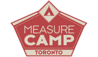

# Analyzing Digital Analytics Data with Generative AI


Copyright, NLP from scratch, 2023.  

[MeasureCamp Toronto 2024](toronto.measurecamp.org)




This is the git repo for the files for the [NLP from scratch](https://www.nlpfromscratch.com) "Analyzing Digital Analytics Data with Generative AI" workshop presented at the 1st Toronto MeasureCamp Unconference on Saturday, October 5th, 2024.

## Description

**Talk Abstract:**  
In this hands-on technical session, we will walk through setting up JupyterAI to allow using GenAI models for coding assistance locally. 

To demonstrate, we will analyze digital analytics data exported from a common platform using python and show that with the help of generative AI, even non-technical practitioners can analyze large datasets locally with minimal coding knowledge.

**What You'll Learn:**  
- Working with Jupyter & Jupyter AI to do AI-assisted coding and analysis
- Using the Ollama framework to serve local models

## Dependencies

The notebook is intended to be run locally. It is recommended to set up a `conda` environment or a separate `venv`, after which you should install the Jupyter AI package:

Windows 🪟:
```bash
python -m venv jupyter-ai
.\jupyterai\Scripts\activate
pip install jupyter-ai
jupyter lab
```

Mac 🍎 / Linux 🐧:
```bash
python -m venv jupyter-ai
source jupyter-ai/bin/activate
pip install jupyter-ai
jupyter lab
```

## Files
- Slides 📽️: [MeasureCamp TO 2024 - Analyzing Digital Analytics Data with GenAI.pdf](https://github.com/nlpfromscratch/workshops/blob/master/jupyterai-MeasureCamp-TO-2024/MeasureCamp%20TO%202024%20-%20Analyzing%20Digital%20Analytics%20Data%20with%20GenAI.pdf)
- Notebook ✍️: [Measurecamp_TO_2024-Analyzing_Digital_Analytics_Data_with_GenAI.ipynb](https://github.com/nlpfromscratch/workshops/blob/master/jupyterai-MeasureCamp-TO-2024/Measurecamp_TO_2024-Analyzing_Digital_Analytics_Data_with_GenAI.ipynb)

## Authors
[Myles Harrison](https://www.mylesharrison.com), AI Consultant & Trainer at [NLP from scratch](https://www.nlpfromscratch.com)